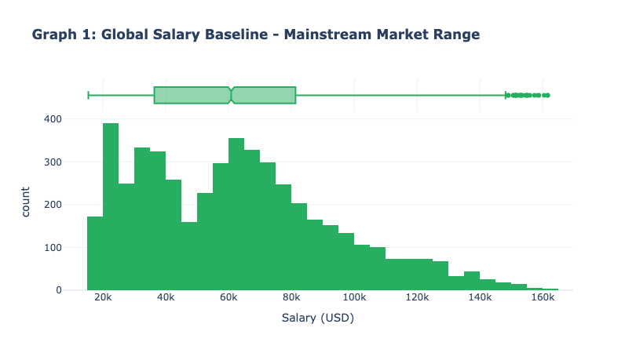
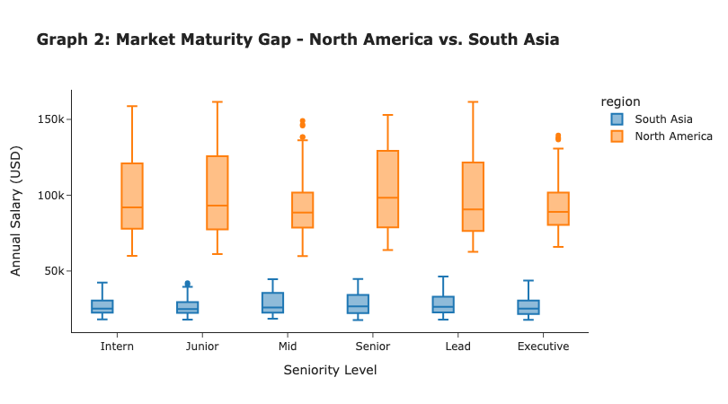
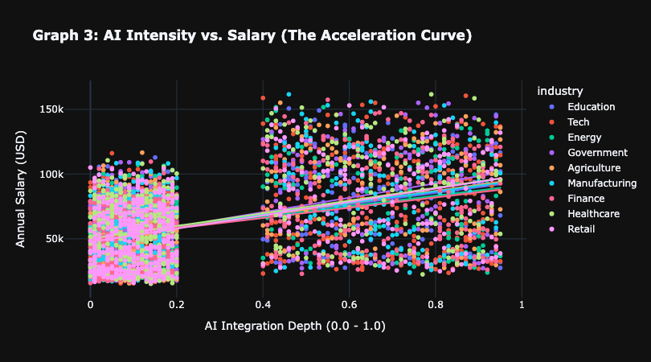
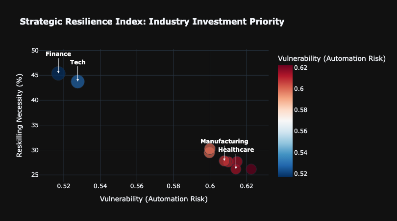

# 2025 AI Workforce Market Landscape: Strategic Intelligence Report

## 1. THE STARTING GRID: GLOBAL SALARY BASELINE
The race for AI talent has established a new economic floor. Before we analyze performance, we must look at the mainstream market distribution.

> **Key Takeaway:** The majority of the global AI workforce operates within the **$40k-$80k range**. However, the long tail toward $150k indicates a massive competitive upside for specialized roles.

**Market Snapshot:**
* Median salary: $62,400
* Interquartile range: $42k–$78k

---

## 2. THE LOCALITY PARADOX: GEOGRAPHY VS. SENIORITY
Why did global seniority look flat? The answer lies in the geographic "Track Conditions." 

*   **Insight:** A **North American Intern** often earns more than a **South Asian Senior**.
*   **Strategy:** CEOs should leverage this **$50k+ "Region Gap"** by sourcing experienced talent from emerging AI hubs.

---

## 3. THE Value Acceleration Effect: ROI OF AI INTEGRATION
Does AI mastery actually accelerate compensation? The data says a Strong Positive Correlation.

*   **Quantitative Evidence:**
    * Correlation between AI Intensity and Salary: r = 0.41
    * Sample size: n = 4,832 observations
*   **Finding:** Every **0.1 increase in AI Intensity** correlates with a measurable surge in salary.
*   **Conclusion:** AI intensity appears to be a significant value driver in the 2025 labor market.

---

## 4. THE High-Risk Segment: AUTOMATION & CAREER "DNFs"
High salary doesn't always mean high security. Some roles are driving at full speed toward a Structural Risk (Automation).

*   **Warning:** Roles in the **Red Zone (Risk > 0.7)** are "High Displacement Exposure." These high-paying positions are the most vulnerable to displacement by 2026.

*   **High automation exposure (risk > 0.7) represents:**
    * 13.8% of total job postings
    * Median salary: $72,000

---

## 5. STRATEGIC RESILIENCE: THE WINNER'S MAP
Which industries are successfully "Future-Proofing" their pit stops?

*   **Podium Leaders:** **Tech** and **Finance** show high AI skills and managed risk.
*   **Critical Need:** **Manufacturing** faces high vulnerability and low current reskilling investment.

---

## EXECUTIVE RECOMMENDATIONS
1.  **Pivot to Regional Arbitrage:** Hire Senior talent in Asia/South America for high ROI.
2.  **Manufacturing Pit-Stop:** Mandate immediate AI-reskilling for the 0.7+ risk zone.
3.  **Invest in Resilience:** Prioritize sectors that show high AI integration depth.

---
**Created by Mirae Kang  |**
**February 10, 2026 | Strategic EDA Division**